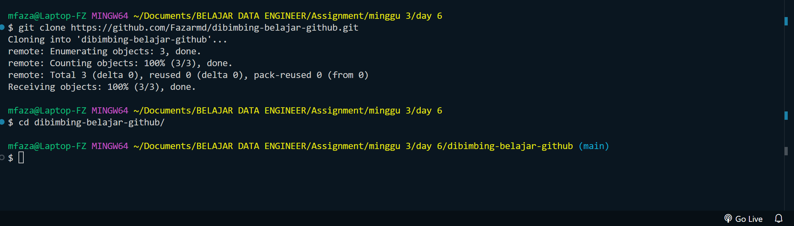
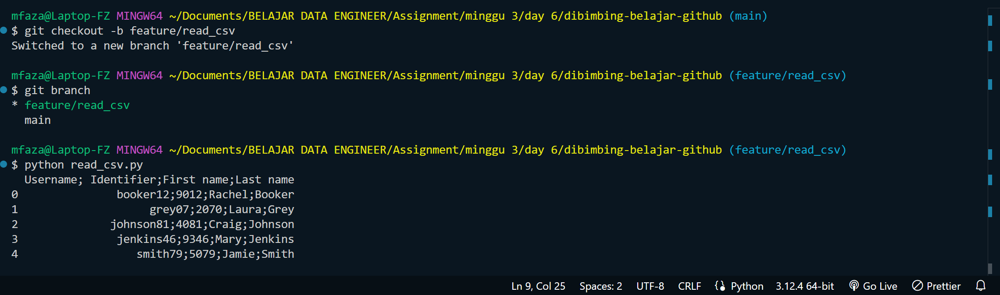
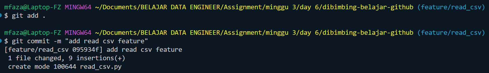
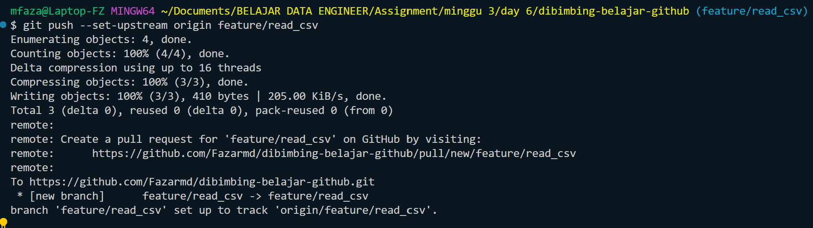
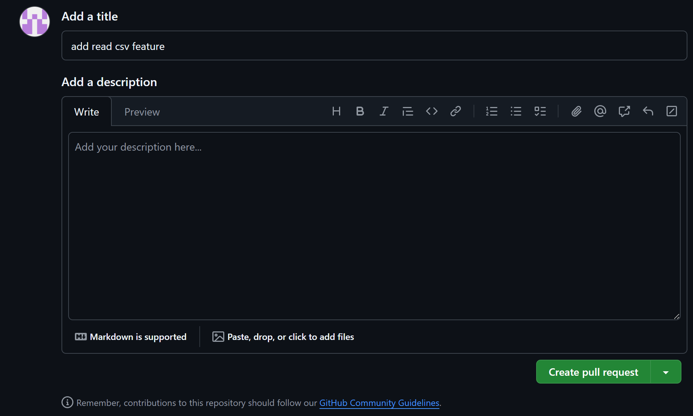
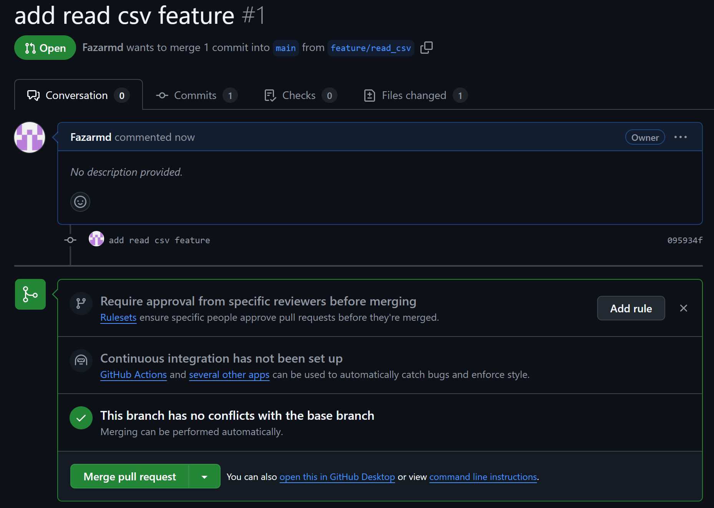
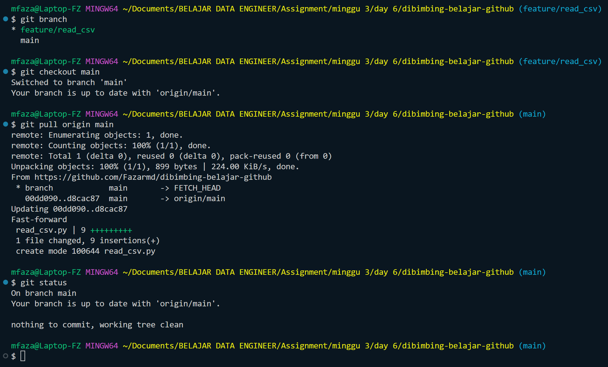

# Assignment: GIT Repository

## Detail Assignment:

- Clone repository ke local laptop / working directory
  
- Membuat branch feature/read_csv yang berisi function untuk membaca file csv
  
- Commit file read_csv.py dan push ke repository
  
  
- Melakukan Pull Request untuk di merge ke branch main
  
  
- Melakukan Pull Remote main ke local main
  
